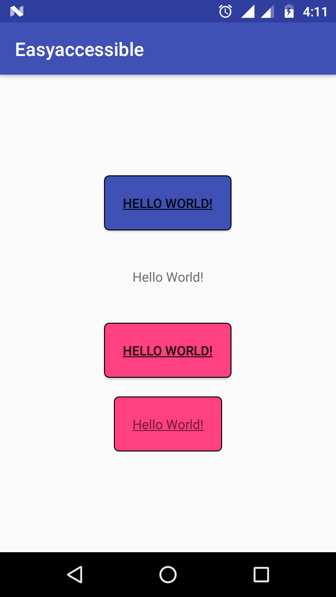

# Easy
  Easyaccessible is easy and effortless use a Custom widgets ad like (Border EditText,Border Button,BorderTextView)

Easy step to use and few line of code.
 
    -> Xml
    -> Java
 
(1)BorderButton
   
    Xml Code:   <www.akashchhetaeasyaccessible.com.accessibleeasyview.border.BorderButton xmlns:app="http://schemas.android.com/apk/res-auto"
                      android:layout_width="wrap_content"
                      android:layout_height="wrap_content"
                      android:padding="20dp"
                      android:text="Hello World!"
                      app:backgroundColorButton="@color/colorPrimary"
                      app:borderColorButton="@android:color/black"
                      app:borderRadiusButton="10"
                      app:borderWidthButton="2"
                      app:fonttypeButton="@string/app_name"
                      app:underLineButton="true" />
                      
    Java Code:   BorderButton mBorderButton.setBorderColor(getResources().getColor(android.R.color.black));
                 mBorderButton.setBackgroundColor(getResources().getColor(R.color.colorAccent));
                 mBorderButton.setUnderLine(true);
                 mBorderButton.setBorderRadius(10);
                 mBorderButton.setBorderWidth(2);
                      
(2)BorderEditText
    
    Xml Code:   <www.akashchhetaeasyaccessible.com.accessibleeasyview.border.BorderEditText xmlns:app="http://schemas.android.com/apk/res-auto"
                        android:layout_width="wrap_content"
                        android:layout_height="wrap_content"
                        android:layout_marginTop="10dp"
                        android:hint="@string/app_name"
                        android:padding="10dp"
                        app:backgroundColorEdit="@android:color/white"
                        app:borderColorEdit="@color/colorPrimary"
                        app:borderRadiusEdit="0"
                        app:borderWidthEdit="2"
                        app:underLineEdit="true" />
                        
    Java Code:  BorderEditText mBorderEditText.setBorderColor(getResources().getColor(android.R.color.black));
                mBorderEditText.setBackgroundColor(getResources().getColor(R.color.colorAccent));
                mBorderEditText.setUnderLine(true);
                mBorderEditText.setBorderRadius(10);
                mBorderEditText.setBorderWidth(2); 
                
(3)BorderTextView

    Xml Code:   <www.akashchhetaeasyaccessible.com.accessibleeasyview.border.BorderTextView xmlns:app="http://schemas.android.com/apk/res-auto"
                        android:layout_width="wrap_content"
                        android:layout_height="wrap_content"
                        android:layout_marginTop="20dp"
                        android:padding="20dp"
                        android:text="Hello World!"
                        app:backgroundColorButton="@color/colorPrimary"
                        app:borderColorButton="@android:color/black"
                        app:borderRadiusButton="10"
                        app:borderWidthButton="2"
                        app:fonttypeButton="@string/app_name"
                        app:underLineButton="true" />
                        
    Java Code:  BorderTextView   mBorderTextView.setBorderColor(getResources().getColor(android.R.color.black));
                mBorderTextView.setBackgroundColor(getResources().getColor(R.color.colorAccent));
                mBorderTextView.setUnderLine(true);
                mBorderTextView.setBorderRadius(10);
                mBorderTextView.setBorderWidth(2);
                                             
 (4)NullOrEqualEditText
 
    Java Code: NullOrEQualsEditText mNullorequalsedittext = findViewById(R.id.yourviewid);
       
               -> mNullorequalsedittext.isEmpty
               -> mNullorequalsedittext.isEqual(String anothertextcomperwiththis)
               
               Both is return boolean(true,false).
               
 (5)BaseActivity
 
    Java Code: It Parent Activity your can use as your Activity class.
               
               (*) Methods of BaseActivity
                  (1)setLayout   
                     -  set xml path direct 
                  (2)Toast(String message)
                     -  set Toast
                  (3)id
                     -  findViewById short cut (idEditText use for only EditText view,idTextView use for only TextView).   
                  (4)More mothods use can easy use with base activity.
                  
                    
Note : This library under devlopment but use can use this 3 view BorderTextView,BorderEditText,BorderButton.......  

Copyright 2018 Akash Chheta.

Licensed under the Apache License, Version 2.0 (the "License");
you may not use this file except in compliance with the License.
You may obtain a copy of the License at

  http://www.apache.org/licenses/LICENSE-2.0

Unless required by applicable law or agreed to in writing, software
distributed under the License is distributed on an "AS IS" BASIS,
WITHOUT WARRANTIES OR CONDITIONS OF ANY KIND, either express or implied.
See the License for the specific language governing permissions and
limitations under the License.                
